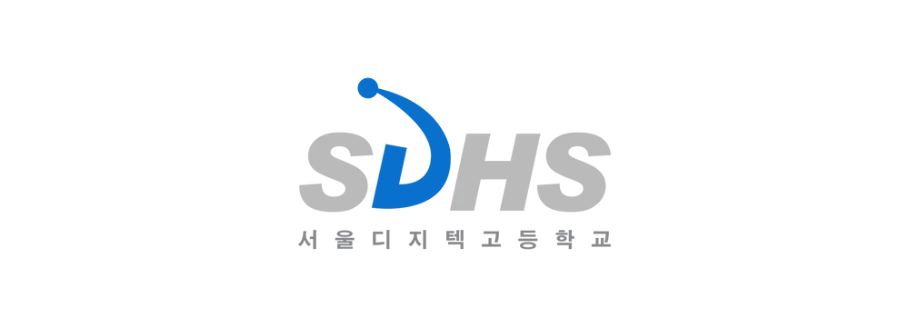

# Home

- 안녕하세요! 디지텍위키에 오신 것을 환영합니다.
- 디지텍위키는 교내 정보 공유 및 학생 간 정보 비대칭 완화을 위해 운영되는 위키입니다.
- 디지텍위키는 서울디지텍고 학생이라면 누구나 기여할 수 있는 위키입니다.
- 검증되지 않았거나 편향된 내용이 있을 수 있습니다.
- 모든 문서엔 CC BY-SA 4.0 국제 라이선스가 적용됩니다.

## 규칙

- **교직원**에 대한 서술 및 언급을 **금지**한다.
- **객관적**으로 서술 한다.
- **교내외 디지텍 관련 사건사고**를 작성하지 **않는다.**
- 교내의 모든 유/무선 네트워크 정보는 국가정보원 『국가·공공기관의 무선망 구축 보안 가이드라인, 국가정보보안 기본지침』 과,
  교육부 『정보보안기본지침』에 따라 대외비로 관리되고 있으니 기재하지 않는다.

## 기여 해주세요!
[기여방법](./기여방법/index.md/)을 읽고 디지텍 위키에 기여해주세요!

디지텍위키는 학생 간 정보 비대칭 완화을 위해 기여자들의 재능기부와 후원으로 운영되는 위키입니다.

학생 및 동문 여러분의 참여와 기여가 디지텍위키를 더욱 풍성하게 만듭니다.

### 기여할 수 있는 내용
- 교내 시설 및 동아리 소개
- 학습 꿀팁
- 교내 행사 후기 및 참여 팁
- 학교 생활에 유용한 팁과 정보
- 이 글을 읽고 있는 당신이 알고 있는 모든 유익한 정보

### 기여 팁
- 문서는 항상 사실에 기반해 작성해주세요.
- 다른 학생들이 읽기 쉽도록 명확하고 간결한 문장을 사용해주세요.
- 필요한 경우, 문서에 출처를 명확히 표기해주세요.

디지텍위키는 여러분의 손으로 만들어가는 공간입니다.

작은 정보 하나라도 공유한다면, 다른 학생들에게 큰 도움이 될 수 있습니다!
지금 바로 기여를 시작해보세요!
