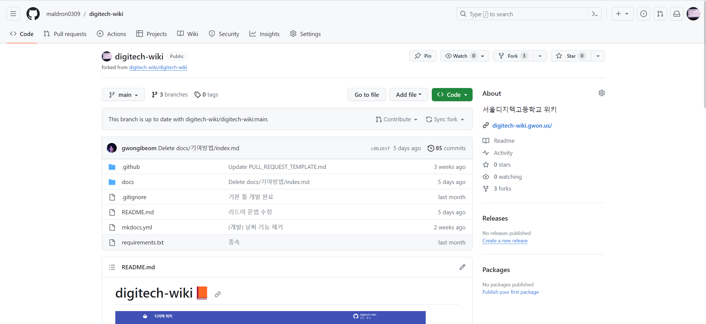
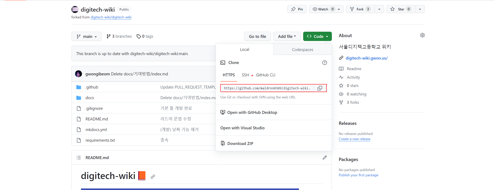

# git 세팅

## fork
우선 디지텍 위키 원본 리포지토리 https://github.com/digitech-wiki/digitech-wiki 로 이동한다

](fork.png)
이후 성공적으로 fork가 된다면 자신의 리포지토리에 원본 리포지토리가 fork가 됐을 것이다

**fork된 자신의 리포지토리를 clone한다.**

Code 버튼을 누르면 나오는 주소를 복사한 뒤 ``git clone https://github.com/maldron0309/digitech-wiki.git`` 
> 위 주소는 예시이므로 자신의 리포지토리를 clone해야한다

이후 변경사항 commit 후 push하게 된다면 다시 자신의 리포지토리 돌아온 뒤
