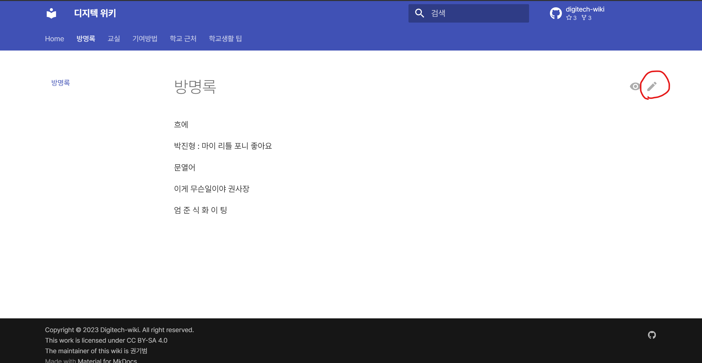
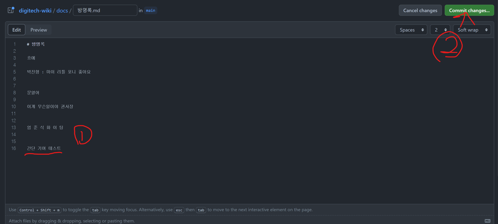
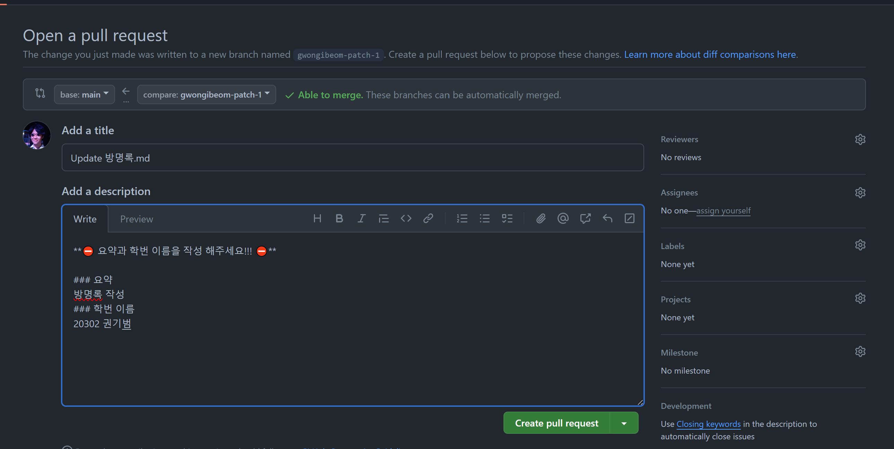

# 간단 기여 방법

## 수정 버튼 클릭

## 기여 후 커밋 생성

## 풀리퀘 생성

## 끝!

이제 메인테이너의 머지만 기다리면 위키에 바로 적용 됩니다.

## 은근히 잘 모르는 깃허브 웹 에디터 사용법

### 폴더 만들기

파일 이름 뒤에 `/`(슬래시)를 입력하면 폴더가 만들어진다.

### 쉽게 이미지 업로드하기

마크다운 작성 중 이미지를 복붙하면 깃허브에 자동으로 업로드 되고 자동으로 이미지 태그가 생성된다.
